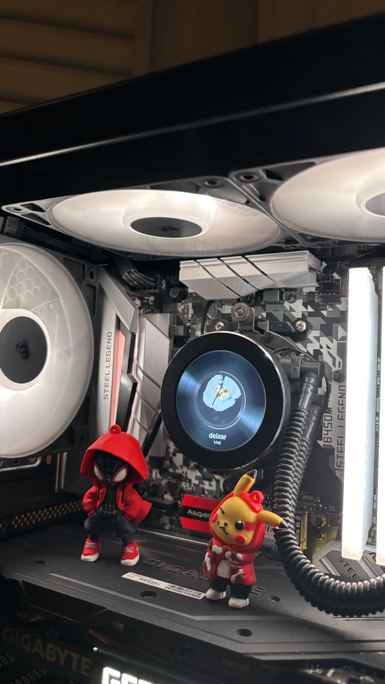
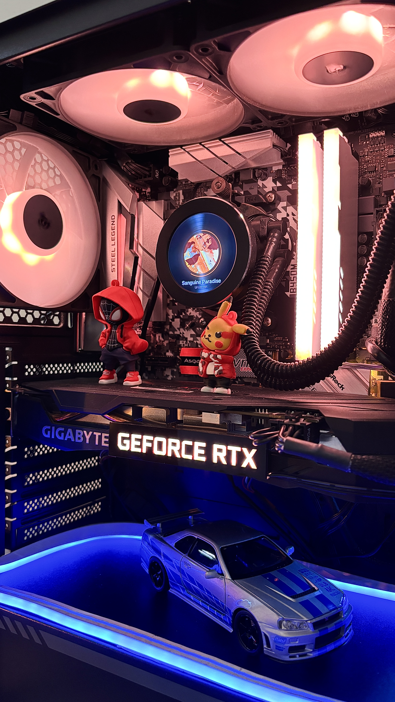

<p align="center">
  
  
</p>

https://github.com/user-attachments/assets/f876053e-42a8-4e0f-b7f9-6a048da14437

Demonstração de 24 segundos: pausa e retomada, transições de fundo, RGB sincronizado e entrada da playlist.

<h1 align="center">Turing Vinyl — Spotify para TURZX</h1>

<p align="center"><a href="README.pt-BR.md">Português</a> · <a href="README.md">English</a></p>

Um app para **Windows** que transforma uma tela USB redonda **TURZX / Turing Smart Screen de 2,1 polegadas e 480 × 480** em um vinil animado do **Spotify**, com capas de álbuns e iluminação **OpenRGB**. Ideal para a tela LCD do water cooler ou uma tela secundária compatível no PC.

O disco desacelera ao pausar e acelera ao retomar. As trocas de música viram a capa; playlist e **A seguir** aparecem no mesmo estilo. A interface acompanha as cores do álbum e permite ajustar brilho, controlar a música e escolher o vídeo de fundo.

**Navegação:** [Tela compatível](#tela-compatível) · [Instalação](#instalação) · [Usando o app](#usando-o-app) · [Integrações](#integrações-opcionais) · [Ajuda](#ajuda-rápida)

## Tela compatível

O setup das fotos usa a tela IPS USB redonda de **2,1″, 480 × 480**, vendida como *“2.1 Inch IPS Secondary Screen Water-Cooled Round Screen”*. O aplicativo indicado pelo vendedor para customização é o **TURZX**.

- [Anúncio da tela no AliExpress](https://pt.aliexpress.com/item/1005006523861753.html).
- O Turing Vinyl se comunica diretamente com a tela por USB; o TURZX não é necessário para usar este app.
- O protocolo atual usa o identificador USB `1CBE:0088`. Telas visualmente iguais podem usar outro protocolo; modelos de 2,8″ e outras telas ainda não foram validados.

## Instalação

**Requisitos:** Windows 10/11, Python **3.13** com Tkinter (versão usada neste setup), tela USB compatível e **GPU NVIDIA com NVENC** e driver instalado. Instale FFmpeg e FFprobe no `PATH`, com os codificadores `h264_nvenc` e `libx264`.

1. Baixe o repositório em **Code → Download ZIP** e extraia a pasta.
2. Abra o PowerShell nessa pasta e execute a instalação uma única vez:

```powershell
py -3.13 -m venv .venv
.\.venv\Scripts\python.exe -m pip install --upgrade pip
.\.venv\Scripts\python.exe -m pip install `
  Pillow libusb-package openrgb-python pycaw comtypes winrt-runtime `
  winrt-Windows.Foundation winrt-Windows.Foundation.Collections `
  winrt-Windows.Media winrt-Windows.Media.Control winrt-Windows.Storage.Streams `
  -e .\turing-smart-screen-cli-main
.\.venv\Scripts\python.exe criar_atalho.py
```

3. Abra o atalho **Turing Vinyl** criado na pasta do projeto com dois cliques. Você pode fixá-lo na barra de tarefas.

Mantenha a pasta extraída e os vídeos incluídos no lugar: o atalho usa essa instalação.

## Usando o app

<p align="center">
  
</p>

1. Conecte a tela por USB e abra o **Spotify para Windows**.
2. Abra o **Turing Vinyl**, escolha um modo e clique em **Iniciar**.
3. Use **Parar** para encerrar a exibição. Fechar o app também encerra sua sessão.

| Modo | O que aparece na tela |
| --- | --- |
| **Dinâmico** | Vinil enquanto a música toca; vídeo de fundo em pausa ou ociosidade. |
| **Spotify** | O vinil permanece na tela. Ao pausar, ele para suavemente, a capa encolhe e o glow/progresso desaparecem. |
| **Vídeo** | Apenas o vídeo de fundo. |
| **Gaming** | Botão independente: reproduz um fundo preparado a 30 FPS para reduzir o processamento, sem informações da música. Ao desativar, retorna ao modo escolhido. |

- **Brilho:** ajuste pelo slider, use **Auto** para o brilho por horário ou o botão de energia para desligar a tela. Os LEDs continuam seguindo o modo.
- **Música:** aleatório, anterior, play/pause, próxima e repetição abaixo das informações da faixa. Os controles dependem do que o Spotify disponibiliza ao Windows.
- **Fundo → Escolher vídeo:** selecione seu próprio fundo. O app converte automaticamente, mostra o progresso e salva a escolha. **Padrão** restaura o vídeo incluído.

<details>
<summary>Print: escolha do vídeo de fundo</summary>

<p align="center">
  
</p>

</details>

## Integrações opcionais

### Playlist e A seguir

Capa, informações da faixa e controles básicos usam os dados de mídia do Windows. Para habilitar a capa da playlist e **A seguir**:

1. Crie um app no [Spotify Developer Dashboard](https://developer.spotify.com/dashboard).
2. Cadastre a Redirect URI `http://127.0.0.1:8765/callback`.
3. Crie `spotify_client_id.txt` na pasta do projeto, contendo apenas o **Client ID**.
4. Clique em **Iniciar** no Turing Vinyl e autorize o acesso no navegador quando solicitado.

Não precisa de Client Secret. A playlist aparece por **5 segundos**; **A seguir** entra cerca de **22 segundos antes do fim**, durante **7 segundos**, quando o Spotify informa a próxima faixa.

### Iluminação RGB

Ative o **servidor SDK do OpenRGB** em `127.0.0.1:6742`. O preset atual controla as zonas Addressable Header, PCH e IO Cover da **ASRock B450M Steel Legend**. Durante a música, os LEDs seguem a cor do álbum; o perfil ocioso se chama `purple rain`.

Outras controladoras precisam de configuração própria; a seleção de dispositivos RGB ainda não está disponível na interface. Evite outro programa RGB controlando o mesmo dispositivo simultaneamente.

## Ajuda rápida

| Problema | O que conferir |
| --- | --- |
| Nada aparece após **Iniciar** | Conexão USB, tela compatível, FFmpeg/NVENC e outro app usando a tela. |
| Playlist / A seguir não aparece | Client ID, Redirect URI, autorização no navegador e conexão com a internet. |
| Controles de música desativados | Abra o Spotify para Windows e toque uma faixa para disponibilizar a sessão de mídia. |
| RGB não responde | Detecção da placa no OpenRGB, servidor SDK e compatibilidade com o preset. |

Para relatar um problema, envie o horário, os passos e um trecho relevante de `tela.log`, na pasta do projeto, removendo dados pessoais. [Abrir uma issue](https://github.com/pvict/TuringScreen-SpotifyVinyl/issues).

## Créditos e licença

Comunicação USB: [Turing Smart Screen CLI](https://github.com/phstudy/turing-smart-screen-cli), com [licença MIT](turing-smart-screen-cli-main/LICENSE). Fontes: Fraunces e DM Sans, incluídas sob OFL. Outro projeto da comunidade para essas telas: [turing-smart-screen-python](https://github.com/mathoudebine/turing-smart-screen-python).

O repositório ainda não declara uma licença para o código e as mídias próprios. Turing Vinyl é um projeto não oficial de [Paulo](https://github.com/pvict).
